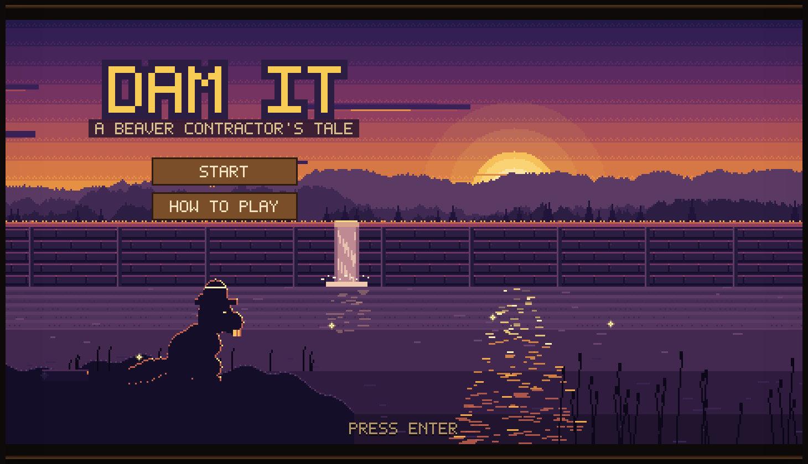
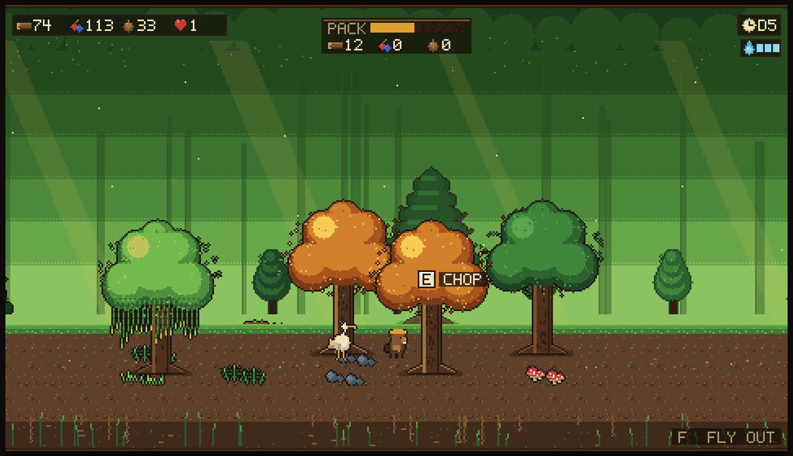
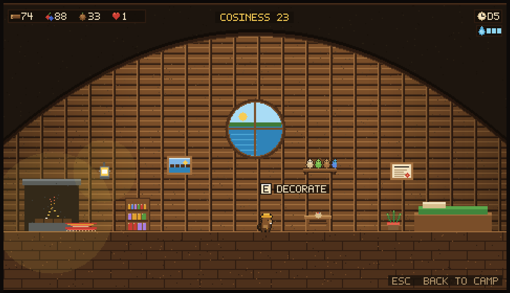
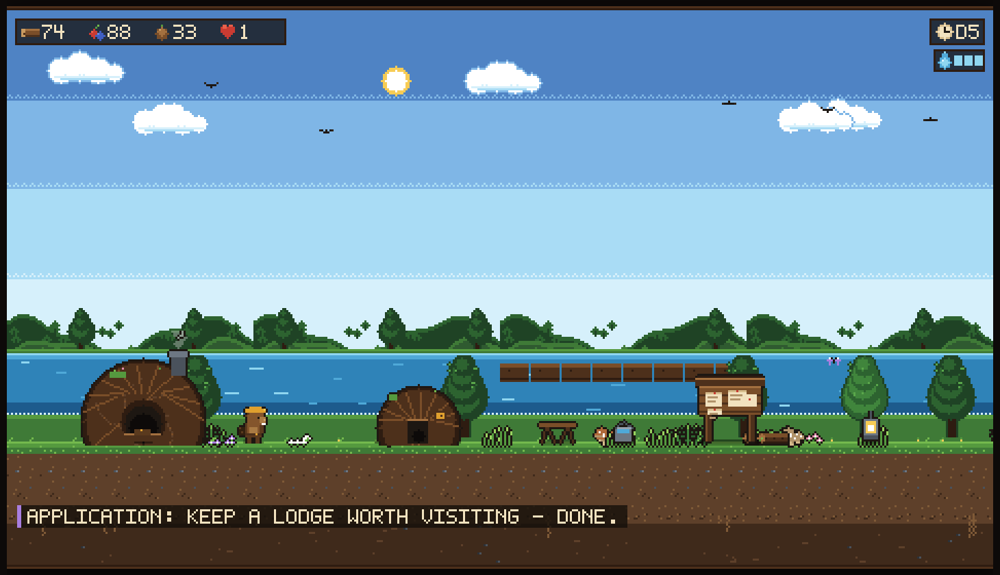
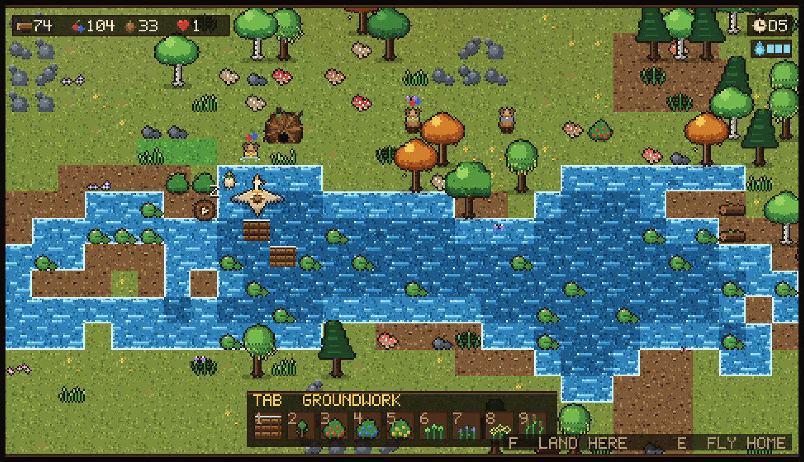
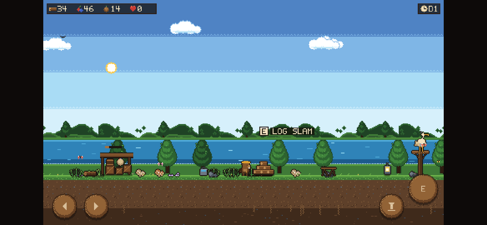

# DAM IT

A cosy pixel-art building game. You are an apprentice beaver builder with one
axe, one heron and an application to the **Beaver Institute of Timberwork**.
Fell your own timber on the forest floor, put a crew to work, dam the river
until a pond rises behind it, furnish a lodge worth visiting, and build every
wild animal in the valley the home it asks for.

Every pixel — terrain, beavers, the heron, the interface, the font — is
generated procedurally at load time. There are no image files, no build step and
no dependencies.











## Play it

The game uses ES modules, so it needs to be served over HTTP (opening
`index.html` off disk will be blocked by the browser).

```bash
python3 serve.py          # then open http://localhost:8000
# or
npx serve .
```

It saves to `localStorage` automatically every 30 seconds and on exit. The title
screen offers **Continue** when a save is waiting.

### On a phone

The game is playable on a touchscreen, held sideways. Cute wooden buttons appear
by themselves the moment it sees a finger: walk and jump in the camp, a flight
pad and a tool-belt button in the air. Everything else is tapped directly —
tap a tree to fell it, tap the ground to build, tap the job board to read it.
Every on-screen button simply holds down the key it stands for, so touch and
keyboard play are the same game. Held in portrait, it asks you to turn the phone
round.



## Where the wood comes from

You do not get timber by wishing for it. From the air, press <kbd>F</kbd> to put
the heron down anywhere on land and the view drops to the **forest floor** — a
side-on slice of that exact patch of valley, with the real trees, bushes and
undergrowth that are standing there. Hold <kbd>E</kbd> to swing the axe: chips
fly, the trunk comes down, and what you cut goes into your pack. Pick berries,
split fallen logs, forage mushrooms. Your pack only holds so much; press
<kbd>F</kbd> to fly out and everything you carry is banked in the stores.

Chop a tree here and it is gone from the valley — the same tree your crew would
otherwise have felled. Early on you have one beaver and no logger, so the first
loads of timber are yours to fetch by paw.

## Three views

**The camp** is a side-scrolling scene you walk around. Everything is a thing you
stand in front of and press <kbd>E</kbd> on:

| Station | What it is |
| --- | --- |
| Job board | Contracts from animals looking for a home, and the hiring desk |
| Bunkhouse | Your crew: levels, energy, wages, and where you spend skill points |
| Stores | The ledger — supplies, wage bill, valley report, residents, save |
| Log pile | **Log Slam**, a timing mini-game that pays out timber and build progress |
| Your lodge | Your own home. Walk in and furnish it |
| Perch | The heron. Climb on to take off |

The camp sits on the bank of the valley's own pond, so the dam you are building
is visible on the horizon behind it, and the water rises there too.

**The valley** is the bird's-eye view you get while flying. This is where the
building happens: mark trees, lay dam segments, plant, and site habitats. The
crew keeps working in the valley whether you are watching or not — and the dam
you build shows up on the horizon back at camp.

**The forest floor** is where you work with your own paws, described above.

### Your lodge

Press <kbd>E</kbd> at the lodge door and you are inside: a woven dome with a
fire, a bed and a round window on the pond. Press <kbd>E</kbd> again to open the
furniture catalogue — rugs, a table, a bookshelf, a potted fern, wall lanterns,
a painting, a trophy shelf, a diploma frame. Click a piece, click a spot, and it
goes up; right-click takes it back down for half the materials. Everything you
add raises your **cosiness**, which the university counts.

### The job board

The board runs the crew as well as the contracts. **Work orders** let you turn
each kind of job off, leave it normal, or pin it as priority — switch felling
off and the crew leaves the trees to you while they build. The **B.I.T.** tab is
your application: six things to prove, checked live against the valley.

## Controls

| | |
| --- | --- |
| <kbd>A</kbd> <kbd>D</kbd> / arrows | Walk (camp) · fly (heron) |
| <kbd>W</kbd> <kbd>S</kbd> | Fly up and down |
| <kbd>Space</kbd> | Jump · slam the log |
| <kbd>E</kbd> | Use the station you are at · fly home · close a screen |
| <kbd>E</kbd> (held) | Chop, pick and forage on the forest floor |
| <kbd>F</kbd> | Land where the heron is hovering · fly back out again |
| Left click | Mark a tree · place a blueprint. Drag to do a whole row |
| Right click | Cancel · demolish · pull out a dam segment |
| <kbd>1</kbd>–<kbd>9</kbd> | Pick a tool · <kbd>Tab</kbd> swaps groundwork and habitats |
| <kbd>Shift</kbd> | Run time faster · <kbd>P</kbd> pause · <kbd>H</kbd> help |

## The story

You are applying to the Beaver Institute of Timberwork, and they do not take
applications on paper. The entrance portfolio is six things: haul forty timber
by your own paw, keep three beavers in work, raise the water two levels, house
three animals, keep a lodge worth visiting, and finally house eight. Finish it
and you are a master builder.

There are three cutscenes — an opening, the letter the heron drops on the board,
and the day the Institute answers — each one a painted pixel scene with
narration, drawn by the same toolkit as everything else.

## The loop

1. **Fell your own timber** on the forest floor, at least until you can afford
   a logger.

2. **Hire a crew** at the job board. Five jobs, each fast at one thing: Logger
   (felling), Hauler (carries double, walks faster), Engineer (dams and
   habitats), Gardener (planting, and plants grow faster nearby), Forager
   (berries and stray seeds). They earn XP, level up and bank skill points for
   Swift Paws, Big Pockets, Craft and Endurance — and they are all paid in
   **berries at dawn**. Miss payday and morale falls until they walk out.

3. **Mark trees for the crew.** From the air, click a grown tree to mark it for
   felling, or drag across a stand. Beavers chop, haul a load back to the lodge and return
   for the rest. **The forest is finite** — every tree you fell is gone unless
   you plant saplings, so replant as you go. Beavers swim, so open water slows a
   crossing but never blocks it; only bare rock does.

4. **Dam the river.** Drop dam segments on the channel — drag along a row to lay
   several. The water only rises when *every* channel tile across the river is
   sealed, and each generated river has a narrows or two where that is cheap.
   Then the level climbs a step at a time and floods the low ground behind it.
   Ground the next rise would swallow is hatched blue, so you can see the future
   shoreline before you plant an orchard in it.

5. **Plant what they ask for.** Sunberries, dewberries and goldberries feed the
   crew and the animals; clover, bluebells and sunflowers are what the pickier
   neighbours want. Reed beds only take in still pond water, so dam first.

6. **Build the habitat.** Each animal picks a spot and shows a ring on the map.
   Everything on its wish-list has to sit inside that ring. Tick every box and
   your new neighbour moves in with hearts, berries and seeds. There are eleven
   to house — duck, frog, rabbit, hedgehog, dragonfly, squirrel, songbird,
   bumblebee, otter, pond turtle and kingfisher — and they knock roughly
   easiest-first, so nobody asks for a deep-water holt on day two.

Butterflies drift over the meadow, fish rise in the pond, fireflies come out
after dusk and flocks cross overhead. None of it is part of the simulation; it
is there so the valley is never still.

## How the art works

There is no sprite sheet. `js/gfx/pixel.js` is a small toolkit — a fixed
palette, offscreen surfaces, dithering, a 5×7 bitmap font (scaled up for the
title), a 1px outline pass, a soft-shadow pass and a rim-light pass that finds
the edges of a silhouette facing the sun. `js/gfx/sprites.js` uses it to draw
every sprite from a seed the first time it is asked for, then caches it. Change
a number in there and the whole valley re-renders differently.

The woodland is six species — oak, pine, birch, willow, maple and a bushy
scrub — each with roots, bark, real branch lines and a four-tone canopy, and
each grown tree is generated in three sway frames so the canopy moves in the
wind while the trunk stays planted. Scattered underneath are mushrooms, ferns,
fallen logs, tall grass, stones and wildflowers, thickest under the trees and
sparse out in the meadow. It all drowns if you flood it, and lily pads drift in
to take its place.

The title screen is painted by the same toolkit: a dithered sunset ramp, three
ridgelines, a wall of backlit logs with water pouring through a notch, a
shimmering reflection column, and a rim-lit beaver watching it all. It is
painted once into a buffer, so holding it on screen costs nothing.

The game draws into a 480×270 buffer that is scaled up by a whole number to fit
the window, so pixels stay square at any size.

Open `dev/sprites.html` (through the same server) to see the entire sprite bank
on one contact sheet — handy when tweaking the generators.

## Source layout

```
index.html          a canvas and nothing else
css/style.css       page background and the pixel-perfect scaling rules
js/config.js        balance tables: jobs, skills, blueprints, animals, tips
js/state.js         the single mutable game state, resources, save/load
js/util.js          RNG, value noise, A* pathfinding
js/world.js         map generation, valley elevation, water-level simulation
js/jobs.js          the job board beavers pull work from
js/beavers.js       hiring, skills, wages, each beaver's state machine
js/plants.js        growth and ripening
js/build.js         placement rules, build sites, demolition
js/animals.js       contracts, need checking, residents
js/player.js        walking in camp and woods, flying on the heron
js/story.js         the B.I.T. application and what triggers each scene
js/critters.js      butterflies, fireflies, fish and passing flocks
js/input.js         keyboard, mouse and touch, in view-space coordinates
js/minigame.js      Log Slam
js/gfx/pixel.js     the pixel toolkit and the bitmap font
js/gfx/sprites.js   every sprite, generated
js/gfx/screen.js    the scaled canvas and the camera
js/scenes/title.js  the sunset title screen
js/scenes/cutscene.js  painted story beats and their narration
js/scenes/forest.js the forest floor you land in and gather from
js/scenes/lodge.js  your lodge interior and the furniture in it
js/scenes/camp.js   the side-scrolling camp
js/scenes/valley.js the bird's-eye valley
js/ui/widgets.js    immediate-mode pixel widgets
js/ui/hud.js        resource strip, day chip, toasts, tool belt
js/ui/board.js      the job board, bunkhouse and stores screens
js/ui/touch.js      on-screen controls for phones
js/main.js          bootstrap, game loop, the two modes
```

Tuning the game means editing `js/config.js`. For poking around, the browser
console has a `DAMIT` hook: `DAMIT.G` is the live state and
`DAMIT.simulate(0.1)` steps the simulation by hand.
