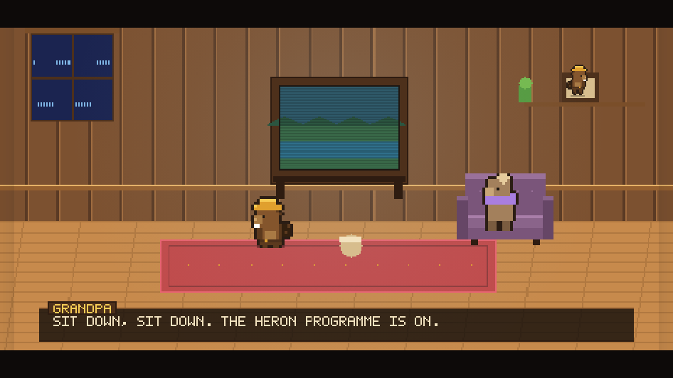
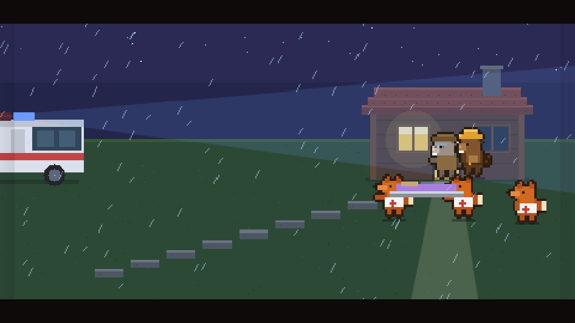
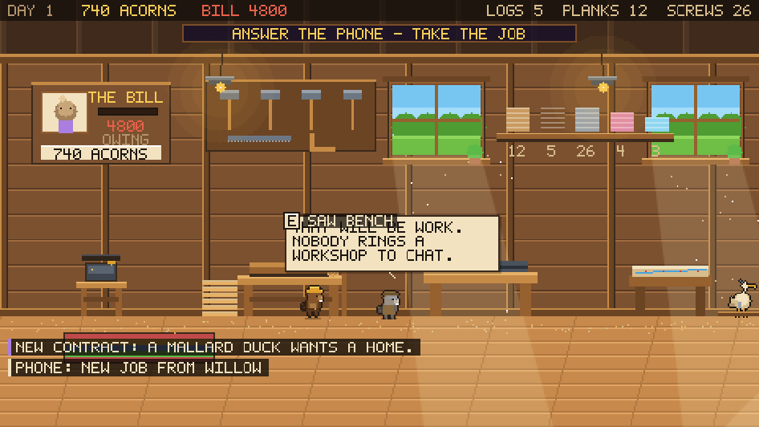
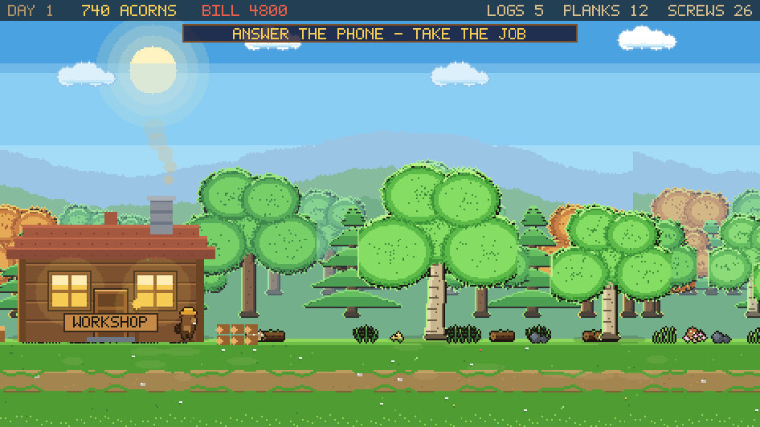
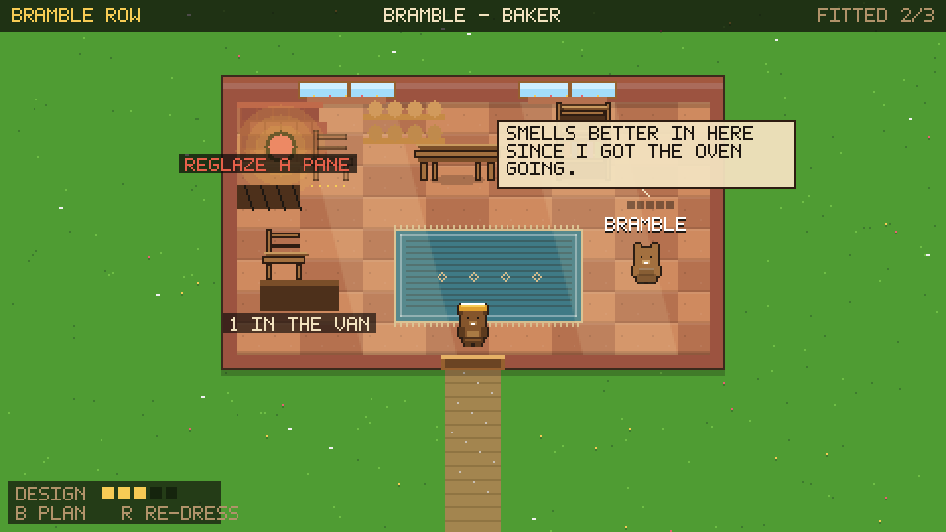
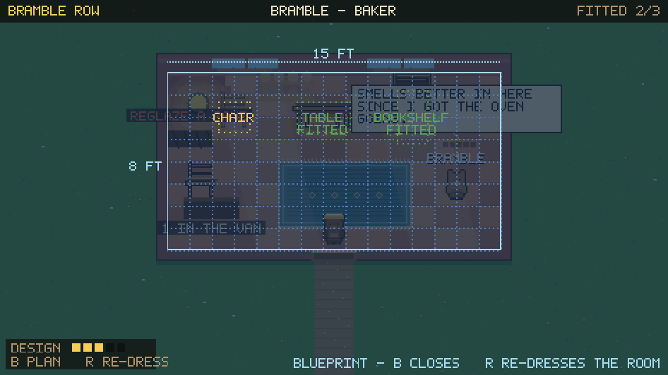

# DAM IT

A cosy pixel-art carpentry game with a story to it. One rainy evening the crash
from the kitchen turns out to be your grandmother; the foxes take her away in
their ambulance, and the infirmary sends a bill for 4,800 acorns. Grandpa hands
you the axe. Everything after that is yours to build.

Fell your own timber, rip it into planks at the saw bench, screw furniture
together by hand, then ride a heron out to the customer who ordered it and fit
the room to the blueprint. Pay the bill piece by piece. There is a valley to dam
out there too, and a crew of beavers who will do it while you work.

Every pixel — terrain, beavers, the heron, the interface, the font — is
generated procedurally at load time. There are no image files, no build step and
no dependencies.
















## Play it

The game uses ES modules, so it needs to be served over HTTP (opening
`index.html` off disk will be blocked by the browser).

```bash
python3 serve.py          # then open http://localhost:8000
# or
npx serve .
```

It saves to `localStorage` automatically every 30 seconds and on exit. The title
screen offers **Continue** when a save is waiting.

### On a phone

The game is playable on a touchscreen, held sideways. Cute wooden buttons appear
by themselves the moment it sees a finger: walk and jump in the camp, a flight
pad and a tool-belt button in the air. Everything else is tapped directly —
tap a tree to fell it, tap the ground to build, tap the job board to read it.
Every on-screen button simply holds down the key it stands for, so touch and
keyboard play are the same game. Held in portrait, it asks you to turn the phone
round.


## The story

The game opens with a cutscene, played as a little film: letterbox bars, a camera
that pushes and pans, hard cuts where they hurt, and dialogue that types itself
out. Nine shots take you from the sofa in front of the television to grandpa's
workshop at dawn — the crash, the dark hallway, the kitchen floor, the phone, the
fox stretcher crew in the rain, the corridor, the bill. Every frame is painted
with the same pixel toolkit as the game, into an offscreen buffer that the camera
then crops; that is where the push comes from. <kbd>Enter</kbd> moves it along,
<kbd>Escape</kbd> skips it.

Sound is synthesised on the spot — there are no audio files. It matters most in
the trees, where the creak that warns you a trunk is coming down is a cue you
have to hear.

## Four places

**The workshop** is home, played side-on. Grandpa leans on the bench with advice.
Everything is a thing you stand in front of and press <kbd>E</kbd> on:

| Station | What it is |
| --- | --- |
| The phone | Texts from customers — take the job or leave it. Also the internet, and where you pay the bill |
| Saw bench | **Rip and shape**: turn a log into planks by hand |
| Assembly bench | The cut list, then **unpack, fit and screw** a piece together |
| Map table | The valley map. The heron flies you out to a customer |
| Back door | Out to the timber |

**The trees** are a side-scrolling wood that grows day by day and leans in the
wind. Chop at the top of the axe swing for a clean bite; when the trunk starts to
creak you have a second and a half to get out from under it, or you wake up in
the leaves having lost half a day.

**A customer's place** is played from above. Meet the animal who ordered the
work, carry each piece in from the van, fit it where the blueprint says it goes,
put right whatever is broken, and dress the room until they love it.
<kbd>B</kbd> pulls up the plan with its dimensions and dashed outlines.

**The camp and the valley** are the original dam-building game, still there and
reachable from the map table.

## The old camp

**The camp** is a side-scrolling scene you walk around. Everything is a thing you
stand in front of and press <kbd>E</kbd> on:

| Station | What it is |
| --- | --- |
| Job board | Contracts from animals looking for a home, and the hiring desk |
| Bunkhouse | Your crew: levels, energy, wages, and where you spend skill points |
| Stores | The ledger — supplies, wage bill, valley report, residents, save |
| Log pile | **Log Slam**, a timing mini-game that pays out timber and build progress |
| Perch | The heron. Climb on to take off |

The camp sits on the bank of the valley's own pond, so the dam you are building
is visible on the horizon behind it, and the water rises there too.

**The valley** is the bird's-eye view you get while flying. This is where the
building happens: mark trees, lay dam segments, plant, and site habitats. The
crew keeps working in the valley whether you are watching or not — and the dam
you build shows up on the horizon back at camp.

## Controls

| | |
| --- | --- |
| <kbd>A</kbd> <kbd>D</kbd> / arrows | Walk · fly · steer the saw · move round a room |
| <kbd>W</kbd> <kbd>S</kbd> | Fly up and down · walk up and down a room |
| <kbd>Space</kbd> | Jump · swing the axe · push the saw · drive a screw |
| <kbd>E</kbd> | Use the station you are at · pick up and fit · close a screen |
| <kbd>B</kbd> <kbd>R</kbd> | Blueprint · re-dress the room (at a customer) |
| <kbd>M</kbd> | Back to the workshop from the old camp |
| Left click | Mark a tree · place a blueprint. Drag to do a whole row |
| Right click | Cancel · demolish · pull out a dam segment |
| <kbd>1</kbd>–<kbd>9</kbd> | Pick a tool · <kbd>Tab</kbd> swaps groundwork and habitats |
| <kbd>Shift</kbd> | Run time faster · <kbd>P</kbd> pause · <kbd>H</kbd> help |

## The working loop

1. **Answer the phone.** A customer texts what they want and what it pays.
   Accept it and it goes on the books.

2. **Fell a tree.** Out the back door, press <kbd>E</kbd> at a grown trunk and
   tap <kbd>Space</kbd> at the top of each swing. Then *listen*: the creak means
   run, and the arrow tells you which way. Trees regrow, and stumps send up new
   stems after a few days.

3. **Rip it into planks.** At the saw bench, hold to push the blade and steer to
   keep it on the line — the wood pulls it about. Then chisel the marks along the
   plank. Straight cutting and clean marks make better stock and more of it.

4. **Build the piece.** Back the screws out of the flat-pack yourself, fit each
   part when it swings square, then drive every fixing — let go inside the green
   and it is tight; hold on and you split the wood. The result is graded, and the
   grade follows the piece to the customer.

5. **Fly it out.** The map table sends the heron. At the site: carry each piece
   in, fit it to the outline, mend what is broken, then talk to the customer.
   You get acorns, friendship, and a gift from whatever trade they work — the
   blacksmith pays partly in screws, the glassblower in panes.

6. **Pay the bill**, on the phone, whenever you have it. Friendships bring bigger
   jobs, new names appear on the map as word gets round, and the internet sells
   machines that make the work easier — a band saw, a drying kiln, a power
   driver — and robot workers who put in a night shift while you sleep.

## The dam crew's loop

1. **Hire a crew** at the job board. Five jobs, each fast at one thing: Logger
   (felling), Hauler (carries double, walks faster), Engineer (dams and
   habitats), Gardener (planting, and plants grow faster nearby), Forager
   (berries and stray seeds). They earn XP, level up and bank skill points for
   Swift Paws, Big Pockets, Craft and Endurance — and they are all paid in
   **berries at dawn**. Miss payday and morale falls until they walk out.

2. **Gather wood.** From the air, click a grown tree to mark it for felling, or
   drag across a stand. Beavers chop, haul a load back to the lodge and return
   for the rest. **The forest is finite** — every tree you fell is gone unless
   you plant saplings, so replant as you go. Beavers swim, so open water slows a
   crossing but never blocks it; only bare rock does.

3. **Dam the river.** Drop dam segments on the channel — drag along a row to lay
   several. The water only rises when *every* channel tile across the river is
   sealed, and each generated river has a narrows or two where that is cheap.
   Then the level climbs a step at a time and floods the low ground behind it.
   Ground the next rise would swallow is hatched blue, so you can see the future
   shoreline before you plant an orchard in it.

4. **Plant what they ask for.** Sunberries, dewberries and goldberries feed the
   crew and the animals; clover, bluebells and sunflowers are what the pickier
   neighbours want. Reed beds only take in still pond water, so dam first.

5. **Build the habitat.** Each animal picks a spot and shows a ring on the map.
   Everything on its wish-list has to sit inside that ring. Tick every box and
   your new neighbour moves in with hearts, berries and seeds. There are eleven
   to house — duck, frog, rabbit, hedgehog, dragonfly, squirrel, songbird,
   bumblebee, otter, pond turtle and kingfisher — and they knock roughly
   easiest-first, so nobody asks for a deep-water holt on day two.

Butterflies drift over the meadow, fish rise in the pond, fireflies come out
after dusk and flocks cross overhead. None of it is part of the simulation; it
is there so the valley is never still.

## The look

Bright, saturated, low-resolution pixel art on a 16px tile grid - the cosy
farm-sim register, warm rather than gloomy. Outlines are a warm brown, never pure
black; light is a visible thing (sun through a window, a lit oven mouth, a lamp
over a bench) and everything that stands on the floor casts a soft contact
shadow so it sits in the room rather than on top of it.

The cast is one sprite bank. `js/gfx/actors.js` builds every character to the
same 16x18 pattern as the beaver you already played - same fur ramp, same 1px
outline, same ground shadow - and adds the poses the story needs: chopping,
sawing, driving screws, carrying, kneeling, lying down, plus four-direction
top-down versions for the scenes played from above. The cutscene blows those same
sprites up by a whole number, so the beaver in the film is the beaver in the game.

Rooms are small on purpose. The workshop is one cabin you can nearly see all of
at once, and a customer's place is fifteen tiles by eight - big enough to fit the
furniture out, small enough that the character never looks like a doll in a hall.

## How the art works

There is no sprite sheet. `js/gfx/pixel.js` is a small toolkit — a fixed
palette, offscreen surfaces, dithering, a 5×7 bitmap font (scaled up for the
title), a 1px outline pass, a soft-shadow pass and a rim-light pass that finds
the edges of a silhouette facing the sun. `js/gfx/sprites.js` uses it to draw
every sprite from a seed the first time it is asked for, then caches it. Change
a number in there and the whole valley re-renders differently.

The woodland is six species — oak, pine, birch, willow, maple and a bushy
scrub — each with roots, bark, real branch lines and a four-tone canopy, and
each grown tree is generated in three sway frames so the canopy moves in the
wind while the trunk stays planted. Scattered underneath are mushrooms, ferns,
fallen logs, tall grass, stones and wildflowers, thickest under the trees and
sparse out in the meadow. It all drowns if you flood it, and lily pads drift in
to take its place.

The title screen is painted by the same toolkit: a dithered sunset ramp, three
ridgelines, a wall of backlit logs with water pouring through a notch, a
shimmering reflection column, and a rim-lit beaver watching it all. It is
painted once into a buffer, so holding it on screen costs nothing.

The game draws into a 480×270 buffer that is scaled up by a whole number to fit
the window, so pixels stay square at any size.

Open `dev/sprites.html` (through the same server) to see the entire sprite bank
on one contact sheet — handy when tweaking the generators.

## Source layout

```
index.html          a canvas and nothing else
css/style.css       page background and the pixel-perfect scaling rules
js/config.js        balance tables: jobs, skills, blueprints, animals, tips
js/state.js         the single mutable game state, resources, save/load
js/util.js          RNG, value noise, A* pathfinding
js/world.js         map generation, valley elevation, water-level simulation
js/jobs.js          the job board beavers pull work from
js/beavers.js       hiring, skills, wages, each beaver's state machine
js/plants.js        growth and ripening
js/build.js         placement rules, build sites, demolition
js/animals.js       contracts, need checking, residents
js/player.js        walking in camp, flying on the heron
js/critters.js      butterflies, fireflies, fish and passing flocks
js/input.js         keyboard, mouse and touch, in view-space coordinates
js/minigame.js      Log Slam
js/story.js         the campaign: the bill, money, materials, friendships
js/orders.js        customers, furniture, the jobs that flow between them
js/shop.js          the internet: machines and robot workers
js/audio.js         every sound, synthesised - no audio files
js/gfx/pixel.js     the pixel toolkit and the bitmap font
js/gfx/furniture.js furniture art, shared by bench, van and customer's room
js/gfx/sprites.js   every sprite, generated
js/gfx/screen.js    the scaled canvas and the camera
js/scenes/title.js  the sunset title screen
js/scenes/camp.js   the side-scrolling camp
js/scenes/valley.js the bird's-eye valley
js/scenes/cutscene.js  the opening film: shots, camera, dialogue
js/scenes/workshop.js  grandpa's workshop, the hub
js/scenes/forest.js    the timber, and felling it without being flattened
js/scenes/travel.js    the map table and the flight out
js/scenes/site.js      a customer's place, from above
js/minigames/saw.js       rip and shape a log
js/minigames/assemble.js  unpack, fit, screw together
js/ui/widgets.js    immediate-mode pixel widgets
js/ui/hud.js        resource strip, day chip, toasts, tool belt
js/ui/board.js      the job board, bunkhouse and stores screens
js/ui/phone.js      texts, jobs, the internet, the bill
js/ui/buildmenu.js  the cut list over the assembly bench
js/ui/touch.js      on-screen controls for phones
js/main.js          bootstrap, game loop, the two modes
```

Tuning the game means editing `js/config.js`. For poking around, the browser
console has a `DAMIT` hook: `DAMIT.G` is the live state and
`DAMIT.simulate(0.1)` steps the simulation by hand.
