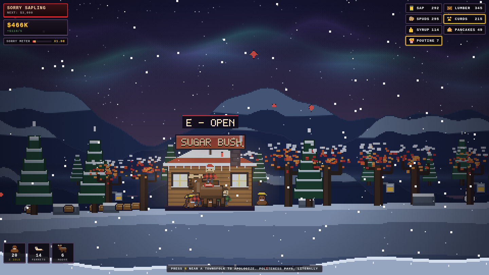

# Average Canadian Simulator

A 2D pixel-art side-scrolling empire builder about hiring beavers, employing ferrets,
fuelling moose with maple syrup, and apologizing to absolutely everyone.

You wear the red-and-black buffalo plaid. You build an empire out of syrup and poutine.
Sorry aboot it.



## Play it

No build step, no dependencies. Either:

```
open index.html          # double-click works, the scripts are classic <script> tags
```

or serve it if your browser is fussy about `file://`:

```
npx http-server . -p 8080   # then visit http://localhost:8080
```

For a single self-contained file you can email to your buddy:

```
node tools/build.js      # writes dist/index.html
```

## The loop

Three species, three jobs. That's the whole country.

| Crew | Job | Where |
|---|---|---|
| **Beavers** | Gather raw goods | Lumber Camp, Sugar Bush, Spud Farm, Dairy Barn |
| **Ferrets** | Craft finished goods | Syrup Boilery, Pancake House, La Poutinerie |
| **Moose** | Haul goods to market | Moose Stable &rarr; Trading Post |

```
sap ──┐
      ├─> SYRUP ──┬─> PANCAKES ──┐
lumber┘           │              ├─> moose caravan ──> $$$
spuds ─┬─> POUTINE ──────────────┘
curds ─┘
```

Moose burn maple syrup as fuel — two jugs per caravan, and more if you ride one
yourself. Run dry and the moose walks home without you.

## Controls

| Key | Does |
|---|---|
| `A` / `D` | Walk |
| `W` / `Space` | Jump |
| `Q` | Swing the axe — tap a maple for sap, chop a pine for lumber |
| `E` | Interact with a building (build, upgrade, staff, sell) |
| `R` | Apologize. Raises the Sorry Meter, which is a real production multiplier |
| `F` | Whistle for a moose and ride it |
| `T` | Toss a Timbit at a townsfolk. They will apologize |
| `Tab` | Empire panel — hire, assign, stats |
| `M` | Mute |
| `Esc` | Close panel |

## Systems worth knowing

- **Sorry Meter** — apologizing raises it up to +50% output across the whole empire.
  It decays, so keep saying sorry.
- **Supervision** — standing near a building gives it +40% output. Walk yer route.
- **Morale** — Tim Bortons and the Backyard Rink multiply every worker's output.
- **Ranks** — nine of them, from Lost Tourist to Prime Minister of Maple ($1.5M earned).
- Progress autosaves to `localStorage` every ten seconds.

## Code layout

```
index.html          shell + DOM overlays
css/style.css       HUD, panels, title screen
src/sprites.js      pixel-art foundry: 5x7 bitmap font, procedural buffalo plaid,
                    characters, animals, buildings, mountain ridges
src/lines.js        the dialogue bank (heavily weighted toward apology)
src/world.js        terrain, parallax, aurora, snowfall, building layout, economy tables
src/entities.js     player, workers, townsfolk, moose caravans, particles
src/ui.js           DOM HUD, empire panel, toasts
src/game.js         main loop, economy tick, rendering, input, audio, save
tools/smoke.js      headless Playwright smoke test + screenshot sweep
tools/build.js      inlines everything into dist/index.html
```

Rendering is a 480x270 offscreen buffer blitted at integer scale with
`imageSmoothingEnabled = false`, so every pixel is a real pixel. Sprites are
built from string arrays or `fillRect` blocks at 1px granularity — the plaid is
generated procedurally as a proper buffalo check, red and black squares with the
dark overlap where the threads cross.

## Testing

```
node tools/smoke.js
```

Boots the game headlessly, builds the whole town, hires 40 crew, walks the entire
map, presses every key, runs the caravans, and screenshots every landmark at day
and night. Exits non-zero on any console or page error.
